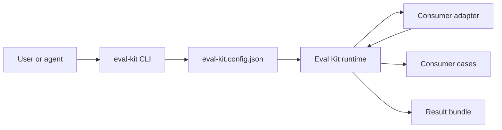
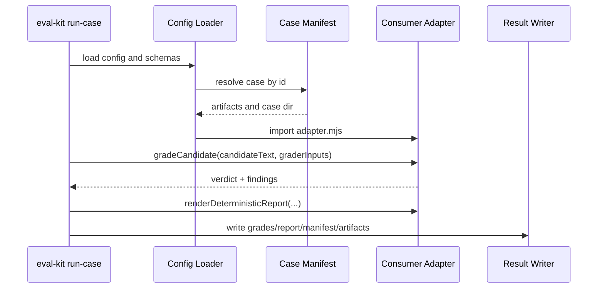

# Architecture

## Boundary

The architecture is defined by one rule:

```text
eval-kit owns mechanics.
consumer repos own meaning.
```

## Components

```text
CLI
  -> config loader
  -> path resolver
  -> schema registry
  -> case discovery
  -> adapter loader
  -> command implementation
  -> result bundle writer

Consumer repo
  -> evals/eval-kit.config.json
  -> evals/adapter.mjs
  -> evals/cases/*
  -> evals/schemas/*
  -> evals/prompts/*
  -> evals/rubric.md
```

## Package responsibilities

Eval-kit owns:

- command routing;
- config schema;
- contained path resolution;
- safe IDs;
- manifest discovery;
- artifact path resolution;
- adapter import;
- deterministic runner plumbing;
- Promptfoo process wrapper;
- result manifests;
- report/artifact records;
- generic bootstrap templates;
- usage skills.

## Consumer responsibilities

Consumers own:

- case purpose;
- source artifacts;
- grader inputs;
- domain schemas;
- deterministic grader semantics;
- report style;
- Promptfoo variable resolution;
- model-judge rubrics;
- pass/fail policy;
- decisions about which result artifacts are safe to commit.

## Runtime flow



## Deterministic run flow



## Model-assisted run flow

Promptfoo-backed commands are optional. They are not part of deterministic bootstrap.

```text
resolveGenerationVars / resolvePointwiseVars / resolvePairwiseVars
  -> bundled or consumer prompt template
  -> Promptfoo run
  -> raw Promptfoo output
  -> parsed candidate or judge result
  -> result bundle
```

Model judge outputs should be treated as advisory until a consumer has calibration evidence.

## Versioned boundaries

These are compatibility-sensitive:

- CLI command names and required flags;
- config schema version;
- case manifest schema;
- result manifest schema;
- adapter hook names and input shapes;
- generated bootstrap file layout;
- bundled prompt variable names.

Breaking changes require a version bump and migration notes.
